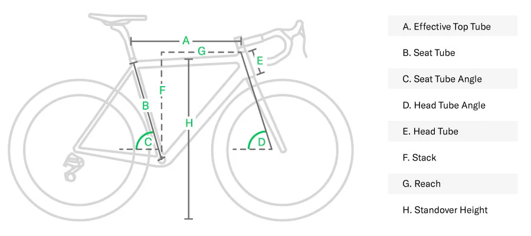

```{r setup, include=FALSE}
knitr::opts_chunk$set(echo = TRUE, message = FALSE,
                      warning = FALSE)
library(readr)
library(tidyverse)
library(tidymodels)
library(dplyr)
library(visdat)
library(ggplot2)
library(naniar)
library(corrplot)
library(janitor)
library(yardstick)

tidymodels_prefer()
```

#### Robert McDonald
#### UCSB Summer 2024

# Introduction
Recently I went on a hike with some family friends and one of them offered to let me try their mountain bike on the trail we were
hiking. I said sure and gave it a try, it was really fun and I was immediately hooked. As someone that loves all sorts of outdoor
sports and sports that have a lot to do with the type of equipment needed, I became very obsessed with learning about bikes
and researching what bike would fit for me to buy. I'm someone that doesn't typically purchase on impulse especially when it has
to do with the hobbies I like, I'm very meticulous, I watch a lot of YouTube to get a baseline understanding, I get to know the 
ins and outs of different products what is high end vs. what is the best bang for buck and after a week or so of that I will 
decided what it is I truly want/need.

After all this, it finally struck me that I could use all this information I was learning through this process for this final 
project. For this project I found a data set on Kaggle that has thousands of bikes that contains each bikes "geometry". A bike's
geometry is the measurements and angles of its frame, this is extremely important, because every bikes geometry or frame design
is carefully created so that it will be most effective in the type of riding that bike should be used for. For example a road 
bike's head tube (which is the part of a bike frame that holds the components of the handle bars down to the fork that holds 
the wheel) will be more upright to promote a more stable bike, whereas in a mountain bike the head tube angle would be more 
extreme and point more away from the frame of the bike to promote a bike that has better handling and that can be quicker to 
move around in the turns. The data set also contains the year of production for the bike, which is very important, because just
like any technology, bikes are constantly being refined. A bike that was made in the 1990's that is considered a mountain bike
might not have the same geometry of a mountain bike that is produced in this modern day, so even though they were designed for 
the same purposed the 1990's bike would have geometry considered out of date. The goal of this project is to be able to correctly
identify what category the bike fits into given the data set.

```{r, echo=FALSE}

```

## The Data
The bike data I am using for this project was found from Kaggle and posted by Dorian Prill which can by found
[here](https://www.kaggle.com/datasets/frequent4242/bicycle-geometry). The data source itself contains 6400 observations and
30 variables, which should be more than enough for this project, especially after doing some data cleaning. This source made
the most sense for me, because it contained the variable I was predicting on, bike category/type and had the most relevant data
I wanted to use when it came to the measurements of a bike's frame geometry.

Dorian Prill. (2023). Bicycle Geometry Dataset  [Data set]. Kaggle. https://www.kaggle.com/datasets/frequent4242/bicycle-geometry

# Exploratory Data Analysis
## Loading in The Data
```{r}
bike_data <- read_csv("bike_geometry_kaggle.csv")

bike_data <- clean_names(bike_data)
colnames(bike_data)
```
Since the data doesn't come with neatly named variables I decided to run clean names in order to get a more uniform naming
method and to make it easier to use the variables going forward. Here I also took a look at all the adjusted column names
in order to start the process of cleaning up the data and managing it to be able to use later in the different models.

## Missing Data 
```{r}
vis_miss(bike_data)
```

Here we can see that of the 30 variables within the data just a little below have of them have a significant amount of data
missing. Initially I was hesitant to use this data set because of that but upon further inspection it shouldn't take away from
what I'm trying to accomplish with this project. Many of these variables were included because certain brands would show 
certain measurements of their bike that weren't industry standard or they had their own way of calculating certain 
measurements that could be different between brand to brand. From this I was able to see what I would need to take out and 
what would be useful for me to keep

## Data Cleaning
```{r}
bike_data <- bike_data %>% select(-c('url', 'motorized', 'frame_config', 'front_center', 
  'seat_tube_angle_effective', 'seat_tube_angle_real', 'top_tube_length', 
  'top_tube_length_horizontal', 'standover_height', 'bottom_bracket_height', 
  'fork_installation_height', 'fork_offset', 'fork_trail', 'frame_size'))

colnames(bike_data)
```

Now I took the step to remove variables that didn't have enough information or wasn't entirely useful, here is a small 
explanation for removing 14 of the variables from further testing:

- <mark>url:</mark> no need to have the website url in the data set, already have relevant information like brand,
model, and year

- <mark>motorized:</mark> the author of the data set noted that this variable wasn't implemented properly and for all bikes
no matter if it was an electric bike or not stated "false"

- <mark>frame_config:</mark> only a handful of manufacturers used this information when displaying specifications for their
bikes

- <mark>front_center:</mark> this was another specification that is not commonly used when talking about bike specifications

- <mark>seat_tube_angle_effective:</mark> this is calculated differently between manufacturers so it is hard to use to 
compare when different companies are getting this number in different ways

- <mark>All Other Variables:</mark> for the rest of the variables there was just not enough information in these columns to use
them, whether this is due to how the data was gathered or if companies even used this commonly it wasn't usable

```{r}
bike_data$suspension_travel_front[is.na(bike_data$suspension_travel_front)] <- 0
bike_data$suspension_travel_rear[is.na(bike_data$suspension_travel_rear)] <- 0

bike_data$year <- as.factor(bike_data$year)
bike_data$wheel_size <- as.factor(bike_data$wheel_size)
bike_data$category <- as.factor(bike_data$category)

bike_data <- na.omit(bike_data)

nrow(bike_data)
```

After taking out unnecessary columns it was time to fix the columns that had to do with suspension measurements. A lot of the 
values in these columns that were null were a result from the bike not having any suspension components, not because the 
the information wasn't gathered. To fix this I ensured that these null values were converted to zeros in order to be used for
testing. I then ensured that the categorical variables were converted to factors to ensure compatibility when running models on
the data as well as removed the remainder of any rows that contained any missing data, after doing this I was still left with 
a respectable 5064 rows to use for the models.

## Visual Analysis
```{r}
bike_data %>% 
  select(where(is.numeric)) %>% 
  cor(use = "pairwise.complete.obs") %>% 
  corrplot(type = "lower", diag = FALSE)
```

What stood out to me from the start was that 'head_tube_length' didn't have any real correlation with anything. I would have 
assumed that for the most part their would be correlation between everything since these are all measurements of a bike frame
that can all be put together, but in this case there was no correlation. For the most part nothing else surprised me here in 
this graph, it makes sense, something that can be put together and the measurement of that final product have to somewhat
correlate or else it wouldn't be possible to create, there can't be any real extremes when it comes to bike frames, because 
these are all final products that are sold to consumers and not some crazy designs that are being used to test bike technology.

```{r}
bike_data %>% 
  ggplot(aes(x = category)) +
  geom_bar() + 
  labs(x = "Bike Category", y = "Number of Bikes", title = "Distribution of the Different Category of Bikes")
```

Here we can see the clear majority of the types of bikes in the data set is mountain bikes at just under 4000 with gravel/cross
country bikes taking up over 600 spots and road bikes which are around 500. There is few bikes in the data set that make up the 
other category. In a perfect world of testing this would not be ideal, I would have liked there to be more bikes that filled up
each category as well as more categories, there are many different types of mountain bikes out there other than the data set 
just pooling them under the umbrella of mountain, but this was the best data set I was able to find on Kaggle regarding this 
type of information and with all the different geometry measurements, so this hopefully will be sufficient.

```{r}
bike_data %>% 
  ggplot(aes(wheel_size)) + 
  geom_bar(aes(fill = category)) + theme(axis.text.x = element_text(angle = 90)) +
  labs(x = "Wheel Size (inches)", y = "Number of Bikes", title = "Number of Bikes in Each Category by Wheel Size")
```

I wanted to take a look next at how different tire sizes may show what kind of bike it might be. From the graph we can see that
a huge majority of mountain bikes are made with a 29 inch wheel and the second most popular wheel either being a 27.5 inch wheel
or what's called a mullet setup where the front and rear wheel are different sizes, the most popular configuration being a 29 
inch wheel on the front and a 27.5 inch wheel on the back. I was initially confused by the 'andere' section, but from some
research it is German for other or different so I would consider that to be a mullet setup as well, just a different term used
from German bike companies.

```{r}
bike_data %>% 
  ggplot(aes(head_tube_angle)) + 
  geom_bar(aes(fill = category)) +
  labs(x = "Head Tube Angle (degrees)", y = "Number of Bikes", title = "Number of Bikes in Each Category by Head Tube Angle")
```

This graph was my favorite graph, I think it's really cool how you can see the trend from mountain bike to gravel/cross country
bike then to road bike. This really shows what I was briefly mentioning as an example during my introduction of this project
and perfectly supports what I was articulating. A mountain bike's head tube angle should be lower to allow for a more agile bike
because of the different terrain it is going over, for a gravel/cross country bike, you do want the benefits of a mountain bike
but you are also going on long rides just like you would a road bike, so you want something in the middle. Last you have the 
road bikes which have head tube angles designed to be more stable and something you're for the most part riding in a smooth line
so you don't want to be fighting the handlebars.

```{r}
bike_data %>% 
  ggplot(aes(suspension_travel_front)) + 
  geom_bar(aes(fill = category)) +
  labs(x = "Front Suspension Travel (millimeters)", y = "Number of Bikes", 
       title = "Number of Bikes in Each Category by Front Travel Suspension")
```

Going in I knew that for the most part the Gravel/CX and the Road bike wouldn't really have an suspension components, because
they're made to get power to the ground and with added suspension you're losing some of what you put into the bike into the 
suspension moving around. So the left side makes sense to me, it is interesting to see that some of those bikes can have 
some suspension that don't move as much like a mountain bike would, you can see that they have under 50 mm of suspension travel.
Then for mountain bikes, it ranges from 100 mm to 175 mm being where a majority of bikes stay around. This seems like the sweet
spot for mountain bikes and interesting to see in visual form.

# Preparing Data For Modeling

## Splitting Data
```{r}
set.seed(0217)

bike_data_split <- initial_split(bike_data, strata = category, prop = 0.75)

bike_train <- training(bike_data_split)
bike_test <- testing(bike_data_split)
```

I've just split the data into a training set and testing set, because my data set is not that large compared to data sets that could have hundreds of thousands of observations, I decided to go a little heavier on the training set in order for the models
to have more data to work with when learning how to pick a category for the bike.

## Creating Recipe & Cross-Validation
```{r}
bike_recipe <- recipe(category ~ year + wheel_size + reach + stack + str + head_tube_angle + head_tube_length + 
  seat_tube_length + chainstay_length + wheelbase + bottom_bracket_offset + suspension_travel_rear + 
  suspension_travel_front, data = bike_train) %>%
  step_dummy(all_nominal_predictors()) %>% 
  step_zv(all_predictors()) %>% 
  step_center(all_predictors()) %>%   
  step_scale(all_predictors())
```

I created the recipe to include 13 predictors of the 16 variables that I chopped the data down to from the initial data set. 
Obviously one is the category variable which we are trying to predict, the other two had to do with a bikes manufacturer and the
model name which I excluded, because obviously these two have no impact on what type of bike they are representing. I then 
ensured that the two categorical variables I am using which are year and wheel size are dummy coded to work within the models.

```{r}
bike_folds <- vfold_cv(bike_train, v = 5, strata = category)
```

For setting up the folds I went with the basic 5-fold Cross-Validation, I felt that this was a good balance, considering I had
just under 4000 observations in my training set and wanted something that would process the models a little quicker than using
10 fold.

# Data Modeled & Tuned

```{r}
load("/Users/robeh/rf_model_results.rda")
load("/Users/robeh/gbt_model_results.rda")
load("/Users/robeh/svm_model_results.rda")
load("/Users/robeh/enet_model_results.rda")
```

I've loaded the rda files for the 4 models I selected to use for the project, those being a Random Forest, Gradient Boosted
Trees, Support Vector Machines, and Elastic Net models. In these rda files I created the workflows for each model and tuned
them to work with the training data as best as possible

# ROC AUC Plots

## Random Forest Plot

```{r}
autoplot(tune_results_rf, metric = "roc_auc")
```

From the graphs you can see that I tuned the model to have minimal node sizes 2 through 10, from each of the graphs between
each node count, you can see the first 3 nodes are the nest and there is a bit of a drop off when it comes to the last two.
Where most of the differences come from in the first three graphs is the number of trees used in the model. For the most part
it showed that 400 and 500 tree coounts were best when just looking at the first graphs, the last two is where things weren't 
as clear cut and overall performance wasn't as good anyways.

## Gradient Boosted Trees Plot

```{r, fig.width=12, fig.height=12}
autoplot(tune_results_gbt, metric = "roc_auc")
```

Looking at the results from the Gradient Boosted Trees model, it is harder to see a clear cut difference between the learning
rates and even harder to see just from the graphs which count of minimal node size performed the best. One interesting thing
to note here though that you can see visually is how the fifth and tenth graphs have the same 2 minimal node size lines
that vary from the rest of them. These being 5 and 8, it is interesting, because we don't see this anywhere else through 
the Gradient Boosted Trees plotted graphs, for the most part these lines are very close together.

## Support Vector Machines Plot

```{r}
autoplot(tune_results_svm, metric = "roc_auc")
```

Compared to the last two models, the Support Vector Machines model is the easiest model to digest out of the 4 models I 
chose to train on the data set. For the most part each of the radial basis function lines don't overlap and mostly move smoothly
from the left to the right. However, of the functions that did perform the best, there is a slight overlap that happens when the
cost is low. However, it is clear from the graph that the lower the radial basis function was the better it performed on the 
training data set.

## Elastic Net Plot

```{r}
autoplot(tune_results_enet, metric = "roc_auc")
```

The last model plotted was the Elastic Net model. Here it's hard to see which parameter of the proportion of lasso penalty
performed the best. They are all pretty close, which makes sense as there really isn't that much of a difference when it comes
to the range of this parameter. For the most part the lines stuck pretty close together and from the exception of a few.

# Accuracy Plots

## Random Forest Plot

```{r}
autoplot(tune_results_rf, metric = "accuracy")
```

The graphs here do a good job at showing the accuracy drop off when the minimal node size increases. The first two graphs there
isn't too much of a difference, but looking closely you can see how the first graphs averages' among the number of trees 
parameter is a little better than the second graph. However, past those two graphs it is clear that a drop off takes place and 
that the model doesn't hold onto its accuracy.

## Gradient Boosted Trees Plot

```{r, fig.width=12, fig.height=12}
autoplot(tune_results_gbt, metric = "accuracy")
```

Just like when looking at the ROC AUC the everything looked very similar between all the different values of the learning
rate. The only difference came when looking at the fifth and tenth graphs that follow the same trend of being outlier from 
the rest of the graphs. The tenth graphs experiences a drop off but all of the lines representing the different values of 
the minimal node size stay above or just below 95%. When it came to the fifth graph however, one line stands out that
represents a minimal node count of 5 and the accuracy for that falls below 80% which is abnormal for this model.

```{r}
autoplot(tune_results_svm, metric = "accuracy")
```

This graph is somehow even more straight forward than the graph of the AUC ROC. All of the lines don't intersect and the lines 
match up with how they were plotted in the AUC ROC graphs. Nothing too interesting here that wasn't already mentioned when 
looking at the past metric that was explored previously.

## Elastic Net Plot

```{r}
autoplot(tune_results_enet, metric = "accuracy")
```

The one thing I noticed immediately from the plotted points is how they all start from a similar point when the regularization 
is the lowest and vary smoothly the accuracy gets lower and lower. This smoothness is cool, considering that in the ROC AUC 
graph it was a bit more jarring through each of the points on each of the respective lines.

# Model Selection and Testing

## Choosing Random Forest Model

From the graphs I ultimately decided to go with the Random Forest model. I originally wanted to display all the different models
best fits and have a list of ROC AUC values and the accuracy, however I kept getting the same error no matter what I kept
changing in my code. I feel that I made the right choice here, just from looking at each of the graphs closeup it appeared to 
me that the best fit in the Random Forest model proved to be the best out of all the other models and that's why I'm selecting
it to put it to the test on the bike test data set.

## Results of The Test Data Set

```{r}
rf_predictions <- predict(best_rf_fit, new_data = bike_test, type = "prob")

rf_results <- bind_cols(bike_test, rf_predictions)

rf_auc <- rf_results %>%
  roc_auc(truth = category, starts_with(".pred_"))
rf_auc
```

Although I wasn't able to accurately choose my model off of exact values of ROC AUC and each model's accuracy, the Random Forest
model did great when it came to the testing data set of the bikes. It was able to achieve a score of .972 which I am very proud
of. With the data set I used I feel that this is a very understandable score, there were only four categories the model had to 
predict based off of the predictors and for the most part most of the bikes ended up in the mountain bike category.

# Conclusion

Overall I had a very good time through the project process and creating this final result. Looking back at the models I selected
I feel that each one of them did a respectable job at predicting the category that a bike should fit into with the predictors
I supplied each of them. In then end it just so happened to look like the Random Forest Model did the best to beat them to 
being used on the testing data set. Like I mentioned after using the model on the testing set, I felt that the reason for all
of their high AUC ROC scores was because of the data set itself. There weren't a lot of categories to choose from and even just
looking at the distribution of the categories, it was clear the the mountain bikes took up a huge majority of the data set. It
would've been nicer if the data set had way more categories, which would have made it more interesting to see the differences
in each model's performance.

Looking back at it from this completed perspective there are many things that I would like to implement next time around or even
change completely. For starters the data set itself, I know I mentioned it a lot already, but maybe I could have tried to look
deeper into a data set that would have more categories to choose from. Potentially I could have created my own, but during the
summer quarter, it would have been a little hard to figure that all out with my schedule. On a personal note, the time 
management wasn't the best and I under estimated how long it took to set up each of the models and get them tuned, some of the 
models took a very long time to run and giving myself more time would have helped me get through that step and focus on other
aspects of the project. Some errors I wasn't able to resolve, like being to display all the ROC AUC results from each of the 
models I chose to use. This would've made my project more complete and add more credibility to my findings. Even with all this 
I think the final result is something that is good for now, but has the potential to be improved on and be significantly better 
in the future.